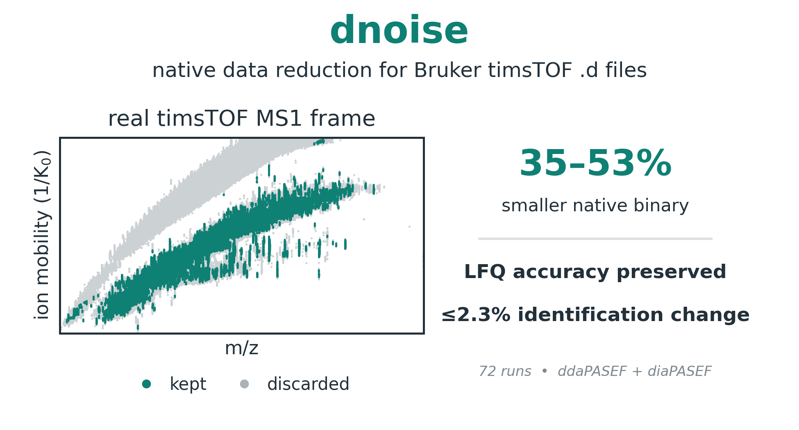

# dnoise

[](https://github.com/pgarrett-scripps/dnoise/actions/workflows/ci.yml)
[](https://crates.io/crates/dnoise)
[](https://docs.rs/dnoise)
[](#license)
[](https://doi.org/10.5281/zenodo.21959649)

Denoise Bruker timsTOF `.d` folders. Real ions form vertical streaks along the
ion-mobility axis; chemical and electronic noise is short, isolated, or
scattered. dnoise keeps the streaks and drops the rest, writing a cleaned `.d`
that stays drop-in compatible with the Bruker SDK and existing search tools.



Across 72 ddaPASEF + diaPASEF benchmark runs: **35-53% smaller** native
binaries, LFQ accuracy preserved, and at most a 2.3% change in
identifications. No per-dataset calibration or tuning is required.

## Install

```bash
cargo install dnoise
```

Or download a prebuilt binary (CLI + GUI, Linux/macOS/Windows) from the
[releases page](https://github.com/pgarrett-scripps/dnoise/releases).

## Usage

The defaults are the configuration benchmarked in the paper — no flags needed:

```bash
dnoise input.d output.d
```

```text
INFO dnoise::writer: denoise: frame inventory scheme="ddaPASEF" frames=8639 ms1=786 msms=7853
INFO dnoise::writer: MS1 selection-polygon gate active
INFO dnoise::writer: denoise: complete frames=8639 raw_points=300509979 kept_points=110092035 kept_pct=36.64
```

By default only **MS1** frames are filtered, so MS/MS spectra — and therefore
identifications — are untouched. Acquisition-aware gates detect whether the
run is ddaPASEF or diaPASEF and apply the matching geometry automatically; on
runs where a gate's geometry is absent it is a silent no-op.

Useful variations:

| Command | What it does |
|---|---|
| `dnoise in.d --in-place` | Overwrite the input (atomically, with a rollback on failure). |
| `dnoise in.d out.d --dry-run` | Report the reduction without writing anything. |
| `dnoise in.d out.d --denoise-msms` | Also denoise MS/MS spectra (changes IDs; re-search to measure). |
| `dnoise in.d out.d --config my.toml` | Load parameters from a TOML file ([example](dnoise.toml)). |
| `dnoise in.d out.d --report run.json` | Write effective config + reduction stats as JSON. |

Every knob — filter parameters, per-gate control, region-of-interest cropping,
smoothing and centroiding stages, logging — is documented in the
**[full reference](docs/reference.md)** and in `dnoise --help`. The method
itself is described in [ALGORITHM.md](ALGORITHM.md).

## Library usage

dnoise is also a Rust library ([docs.rs](https://docs.rs/dnoise)). Depend on it
without the CLI's dependencies:

```toml
[dependencies]
dnoise = { version = "0.1", default-features = false }
```

```rust,no_run
use dnoise::{FilterParams, Stages, denoise};
use std::path::Path;

let stats = denoise(
    Path::new("input.d"),
    Path::new("output.d"),
    &FilterParams::default(),
    &Stages::default(), // optional stages (halo, gates, smoothing, centroiders); all off
    false,              // don't overwrite an existing output
)?;
println!("{} -> {} points", stats.raw_points, stats.kept_points);
# Ok::<(), dnoise::DnoiseError>(())
```

A lower-level API exposes the filter on in-memory frames (`FlatFrame`,
`filter_iterated`) and the type-2 codec directly; see
[docs.rs](https://docs.rs/dnoise) and [docs/reference.md](docs/reference.md).

## Compatibility

Output is always compression **type 2**, byte-layout compatible with the
Bruker SDK / `timsdata` DLL; validate any output with
`cargo run --release --example validate -- <PATH.d>`. Type-3
(zstd + bitshuffle) *input* is not yet readable — see the
[reference](docs/reference.md#limitation-input-compression-type).

## Reproducing the paper

The manuscript, its Supporting Information, and the benchmark suite that
produced them (configs, scripts, and the frozen dnoise source they ran
against) live in a separate repository, which will be linked here and
archived with a DOI when the paper is published. It rebuilds every figure
and table from the raw `.d` files on PRIDE
([PXD070049](https://www.ebi.ac.uk/pride/archive/projects/PXD070049)).

## Citing this work

If you use dnoise in your research, please cite it. Machine-readable metadata is
in [CITATION.cff](CITATION.cff) (GitHub's "Cite this repository" button reads it),
and each tagged release is archived on Zenodo.

> Garrett, P., Diedrich, J. K., & Yates, J. R. III. dnoise (version 0.1.0) [Software].
> Zenodo. https://doi.org/10.5281/zenodo.21959649

The accompanying paper is in preparation; its citation will be added here on
publication.

## License

Licensed under the [MIT License](LICENSE).
